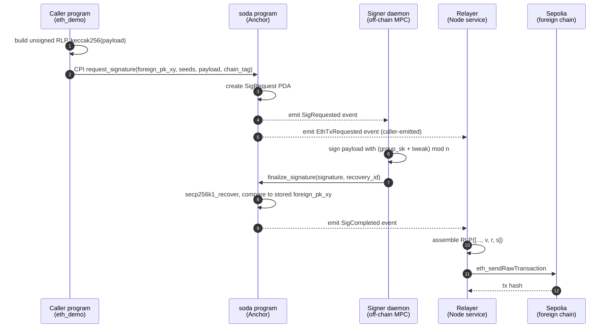
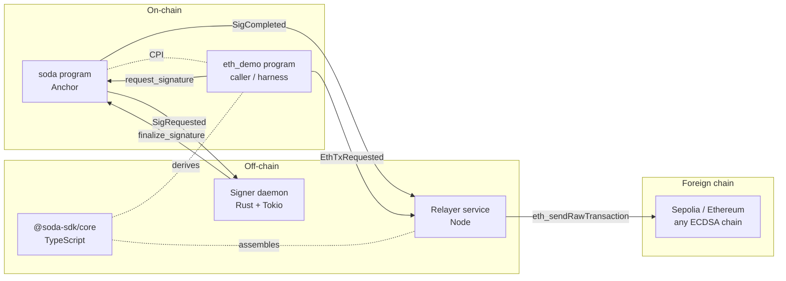

import { Callout } from 'nextra/components'

# Architecture

SODA splits responsibilities across three layers: an on-chain primitive
(`soda` Anchor program), an off-chain MPC committee (signing daemons),
and a permissionless relayer that broadcasts to the foreign chain.

## End-to-end pipeline

The full request-to-broadcast flow, taking the v0 ETH demo as the example:

<Callout type="info">
  In v0 the demo CLI also broadcasts to Sepolia in parallel with the relayer.
  Both attempts converge on the same transaction hash; whichever lands first
  wins, the other observes "already known" and exits cleanly.
</Callout>

## Components

## On-chain (Anchor)

Two programs, both deployed on Solana devnet:

| Program | Devnet ID | Purpose |
| --- | --- | --- |
| `soda` | `99apYWpnoMWwA2iXyJZcTMoTEag6tdFasjujdhdeG8b4` | Core primitive: `init_committee`, `request_signature`, `finalize_signature` |
| `eth_demo` | `9g9eAkNbjpkVLi692vhgcUapJKS26yQTgsLzKbXKJXWM` | Demo harness: builds RLP, keccaks, CPIs into `soda` |

The `soda` program never imports `k256` or any heavy curve crate. It uses only
the Solana runtime's `secp256k1_recover` syscall (~25,000 CU) for verification.
That keeps the BPF stack budget intact.

## Off-chain components

### Signer daemon (`contracts/signer/`)

A Rust Tokio binary that:

1. Subscribes to Solana logs filtered by the `soda` program ID.
2. Decodes `SigRequested` events from `Program data: <base64>` log lines using
   borsh + the `sha256("event:SigRequested")[..8]` discriminator.
3. Computes `foreign_pk = group_pk + tweak·G` for each known requester program
   and matches it against the stored `foreign_pk_xy` on the event. (See
   [Concepts → Derivation](/concepts/derivation).)
4. Signs the payload with `(sk + tweak) mod n` via
   `k256::ecdsa::SigningKey::sign_prehash_recoverable`.
5. Submits a `finalize_signature` instruction (manually built — no
   `anchor-client` dep).

Run with `pnpm signer`.

### Relayer (`apps/relayer/`)

A standalone Node service that:

1. `onLogs`-subscribes to both program IDs.
2. Manually decodes `EthTxRequested` and `SigCompleted` borsh events.
3. Caches `(sig_request, chain_id, unsigned_rlp)` from `EthTxRequested`.
4. On `SigCompleted`, looks up the cached unsigned RLP, re-encodes with
   `(v, r, s)` via `@soda-sdk/core`, and POSTs `eth_sendRawTransaction`.

Run with `pnpm relayer:dev`.

### TypeScript SDK (`packages/soda-sdk/`)

Source-only ESM workspace package. Exports derivation, RLP encode / decode,
EIP-155 `v` calculation, and an `EthRpc` client. Consumed by the demo CLI,
the web app, and the relayer via `workspace:*`.

## Trust model in v0 vs v1

| Layer | v0 (today) | v1 (target) |
| --- | --- | --- |
| Derivation | Off-chain by caller, on-chain compares stored bytes | On-chain `group_pk + tweak·G` (heap-allocated, syscall, or zk) |
| Signing key | Single dev k256 key on disk (`keyshare.dev.json`) | t-of-n MPC threshold ECDSA committee |
| Committee membership | Hardcoded singleton | Restaked SOL via Solayer / Jito Restaking, slashable |
| Replay protection | PDA seed uniqueness | PDA + nonce + expiry |

See [Concepts → Committee](/concepts/committee) for the v1 design.
