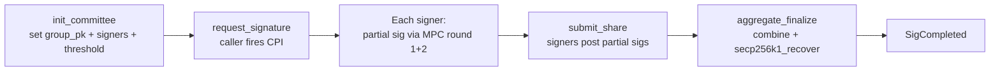

import { Callout } from 'nextra/components'

# Signing committee

The committee is the set of off-chain nodes that hold the secret material
backing `group_pk`. A request is fulfilled when enough of them sign. In v0
the committee is a single dev key on disk; v1 is the production design.

## v0: single dev signer

A single Tokio binary (`contracts/signer/`) holds one 32-byte k256 secret
key in `keyshare.dev.json`. It subscribes to Solana logs, signs whatever
`SigRequested` events it can derive a tweak for, and submits
`finalize_signature`. This is enough to prove the end-to-end pipeline
works on devnet → Sepolia, and it's what `./demo.sh` exercises today.

<Callout type="warning">
  v0 trust assumption: the dev key on disk is honest. There is no
  threshold security, no slashing, no committee rotation. Do not put real
  funds on a v0 deployment.
</Callout>

## v1: t-of-n MPC threshold ECDSA

The production design replaces the single key with a threshold ECDSA
committee using a protocol from the GG18 / GG20 / CGG21 family. Each node
holds one share of `group_sk`; t of n shares produce a valid signature
that recovers to `group_pk`.

<Callout type="info">
  **Why not FROST?** FROST is a threshold protocol for **Schnorr** signatures.
  ECDSA is structurally different (its signing equation is non-linear in the
  secret), so threshold ECDSA needs a different protocol family. The GG-style
  protocols are the standard choice and have been deployed in production by
  Fireblocks, Coinbase Custody, and others.
</Callout>

### Lifecycle



### Restaking-secured membership

Committee membership is gated by SOL restaked through a Solana restaking
layer (Solayer or Jito Restaking). Misbehavior is slashable:

| Misbehavior | Consequence |
| --- | --- |
| Failing to sign within the request window | Slashed bond, share rotated out |
| Signing a payload the caller did not emit | Provably invalid: caller's CPI never produced that `SigRequest`. Slashed via fraud proof. |
| Producing a signature on a request marked `Cancelled` | Slashed via on-chain proof of double-finalization |

This gives SODA economic security proportional to the bonded stake, in the
same model that Eigenlayer-style AVSs use on Ethereum.

### Where this lives in the program

Today the `Committee` PDA stores only `group_pk`. The v1 schema adds:

```rust
struct Committee {
    group_pk_xy: [u8; 64],       // already in v0
    threshold: u8,               // v1
    signers: Vec<Pubkey>,        // v1: SOL pubkeys of bonded signers
    share_commitments: Vec<[u8; 33]>, // v1: per-signer commitment
    epoch: u64,                  // v1: rotation
}
```

A new `submit_share` instruction lets each signer post their partial sig
to a `SigShare` PDA. Once `t` shares exist, anyone can call
`aggregate_finalize`.

## Aggregation strategy

There are two practical paths:

1. **On-chain aggregation.** The program reads `t` `SigShare` PDAs, runs
   the MPC round-2 combiner, and verifies the resulting signature with
   `secp256k1_recover`. Heaviest on-chain compute, simplest off-chain.
2. **Off-chain aggregation.** A designated aggregator (any committee member
   or a permissionless relayer) collects shares, combines them off-chain,
   and submits a single combined signature. The program runs the same
   `secp256k1_recover` check it does in v0.

v1 will likely use option 2 because it keeps the on-chain hot path
identical to v0 and avoids implementing the round-2 combiner inside BPF.

## What's deferred past v1

- HSM / KMS keystore for committee shares (v0/v1 use hex files).
- Cross-region failover and signer health checks.
- Adaptive threshold (raising `t` under load or after a reported incident).
- Permissioned vs. permissionless committee modes for different use cases.
