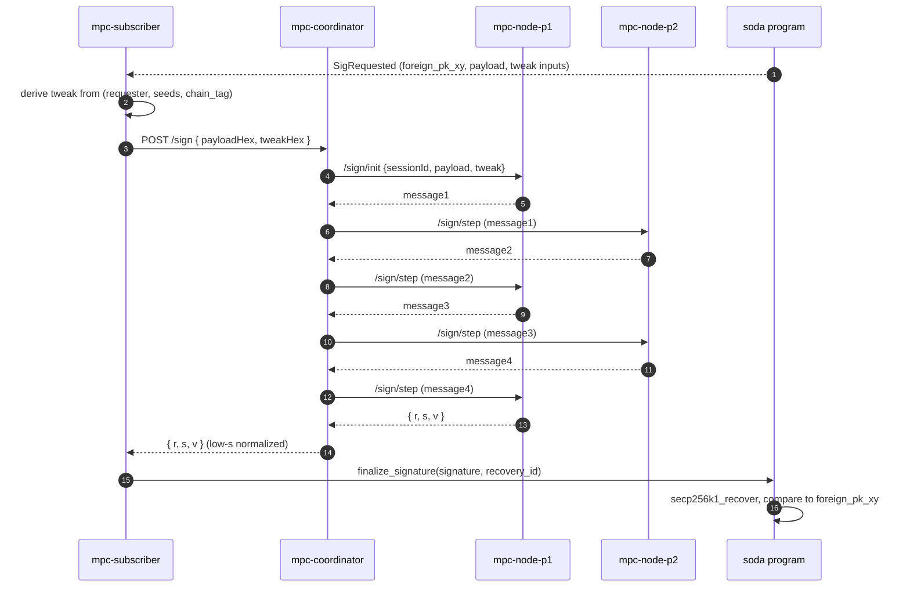
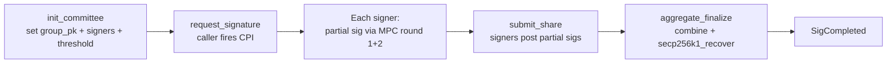

import { Callout } from 'nextra/components'

# Signing committee

The committee is the set of off-chain nodes that hold the secret material
backing `group_pk`. A request is fulfilled when enough of them sign. The
codebase ships **two committee implementations** today: v0 single dev
signer (still works, used by `./demo.sh` by default) and v0.5 real
Lindell '17 2-of-2 MPC ECDSA (the new path).

## v0 — single dev signer

A single Tokio binary (`contracts/signer/`) holds one 32-byte k256 secret
key in `keyshare.dev.json`. It subscribes to Solana logs, signs whatever
`SigRequested` events it can derive a tweak for, and submits
`finalize_signature`. This is enough to prove the end-to-end pipeline
works on devnet → Sepolia, and it's what `./demo.sh` exercises today.

<Callout type="warning">
  v0 trust assumption: the dev key on disk is honest. There is no
  threshold security, no slashing, no committee rotation. Do not put real
  funds on a v0 deployment.
</Callout>

## v0.5 — Lindell '17 2-of-2 MPC ECDSA (shipped 2026-05-11)

Real threshold ECDSA across two off-chain processes. Neither node ever
sees the joint secret — DKG outputs additive Paillier-shared key
material, and signing runs the 4-message Lindell '17 protocol between
the two peers. The output is a normal ECDSA signature that
`secp256k1_recover` verifies on-chain identically to v0; the on-chain
program does **zero** changes (besides the optional
[`update_committee`](/reference/soda-program#update_committee) ix to
swap in the new joint `group_pk`).

| Component | Path | Run | Holds |
| --- | --- | --- | --- |
| Node P1 | `apps/mpc-node` (`MPC_ROLE=p1`) | `pnpm dev` | share `x1` + Paillier keys |
| Node P2 | `apps/mpc-node` (`MPC_ROLE=p2`) | `pnpm dev` | share `x2` + Paillier ciphertext of `x1` |
| Coordinator | `apps/mpc-coordinator` | `pnpm dev` | nothing — forwards opaque protocol bytes |
| Subscriber | `apps/mpc-subscriber` | `pnpm mpc:subscribe` | Solana payer keypair (submits `finalize_signature`) |



### Tweak handling

SODA derives per-PDA foreign addresses via `foreign_pk = group_pk + tweak·G`.
With additive shares (`x1 + x2 = group_sk`), we apply the tweak entirely
to P1's share before signing:

```
x1' = x1 + tweak  (mod n)
x2' = x2          (unchanged)
sig signed under x1' + x2' = group_sk + tweak  →  recovers to foreign_pk ✓
```

This is one line in `apps/mpc-node/src/server.ts`'s
`applyTweakP1` helper. P2 doesn't need to know the tweak.

<Callout type="warning">
  v0.5 caveats: 2-of-2 = zero fault tolerance (both nodes must be up).
  Same person controls both nodes today (containers under the same
  operator). Shares are plaintext JSON. Treat as a deployable proof of
  concept, not production posture. See
  [Deploy → AWS MPC](/deploy/aws-mpc) for the concrete deployment path.
</Callout>

## v1 — t-of-n threshold ECDSA + restaking

The production target. The 2-of-2 path doesn't generalize directly —
Lindell '17 is specifically for two parties. v1 swaps to a protocol from
the GG18 / GG20 / CGG21 family, which supports arbitrary `t-of-n`.

<Callout type="info">
  **Why not FROST?** FROST is a threshold protocol for **Schnorr**
  signatures. ECDSA is structurally different (its signing equation is
  non-linear in the secret), so threshold ECDSA needs a different
  protocol family. GG18 / GG20 / CGG21 are the standard choices and have
  been deployed in production by Fireblocks, Coinbase Custody, ZenGo,
  and Silence Laboratories.
</Callout>

### Lifecycle (v1)



### Restaking-secured membership

Committee membership is gated by SOL restaked through a Solana restaking
layer (Solayer or Jito Restaking). Misbehavior is slashable:

| Misbehavior | Consequence |
| --- | --- |
| Failing to sign within the request window | Slashed bond, share rotated out |
| Signing a payload the caller did not emit | Provably invalid: caller's CPI never produced that `SigRequest`. Slashed via fraud proof. |
| Producing a signature on a request marked `Cancelled` | Slashed via on-chain proof of double-finalization |

This gives SODA economic security proportional to the bonded stake, in the
same model that Eigenlayer-style AVSs use on Ethereum.

### Where this lives in the program

Today the `Committee` PDA stores `group_pk` (33 bytes, compressed),
`authority`, `signer_count`. The v1 schema adds:

```rust
struct Committee {
    group_pk: [u8; 33],          // v0 + v0.5
    authority: Pubkey,           // v0 + v0.5
    signer_count: u8,            // v0 + v0.5 (set to 2 by update_committee)
    threshold: u8,               // v1
    signers: Vec<Pubkey>,        // v1: bonded operator pubkeys
    share_commitments: Vec<[u8; 33]>, // v1: per-signer commitment
    epoch: u64,                  // v1: rotation
}
```

A new `submit_share` instruction lets each signer post their partial sig
to a `SigShare` PDA. Once `t` shares exist, anyone can call
`aggregate_finalize`.

## Aggregation strategy (v1)

There are two practical paths:

1. **On-chain aggregation.** The program reads `t` `SigShare` PDAs, runs
   the MPC round-2 combiner, and verifies the resulting signature with
   `secp256k1_recover`. Heaviest on-chain compute, simplest off-chain.
2. **Off-chain aggregation.** A designated aggregator (any committee member
   or a permissionless relayer) collects shares, combines them off-chain,
   and submits a single combined signature. The program runs the same
   `secp256k1_recover` check it does in v0.

v1 will likely use option 2 because it keeps the on-chain hot path
identical to v0 / v0.5 and avoids implementing the round-2 combiner
inside BPF.

## What's deferred past v1

- HSM / KMS keystore for committee shares (v0 / v0.5 / v1 use hex / JSON files).
- Cross-region failover and signer health checks.
- Adaptive threshold (raising `t` under load or after a reported incident).
- Permissioned vs. permissionless committee modes for different use cases.
