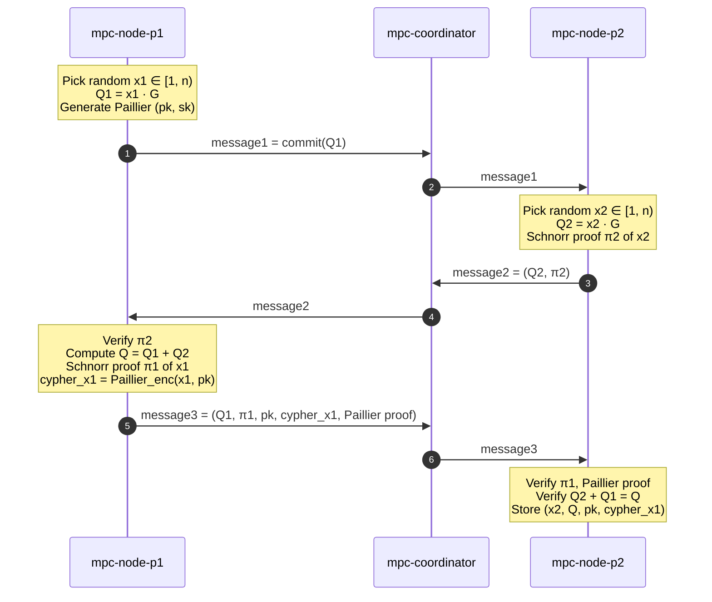
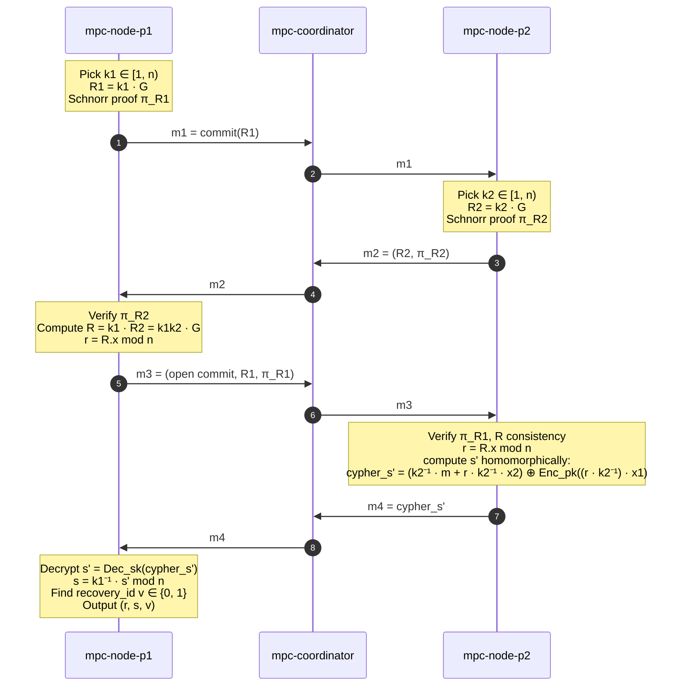

import { Callout } from 'nextra/components'

# How the MPC protocol actually works

This page walks through the literal messages exchanged between the two
`mpc-node` peers during DKG (key construction) and signing — and why
they never talk to each other directly.

<Callout type="info">
  v0.5 ships [Lindell '17](https://eprint.iacr.org/2017/552) — a 2-party
  ECDSA protocol on secp256k1. Implementation:
  [`@safeheron/two-party-ecdsa-js`](https://www.npmjs.com/package/@safeheron/two-party-ecdsa-js).
  Math is real (Paillier homomorphism + Schnorr proofs), not Shamir
  reconstruction or signature federation.
</Callout>

## Topology: P1 ↔ coordinator ↔ P2 (never P1 ↔ P2)

```
┌──────────┐         ┌────────────────┐         ┌──────────┐
│ P1 (x1)  │ ◀──HTTP─│ coordinator    │─HTTP──▶ │ P2 (x2)  │
│ port 8001│         │ port 8000      │         │ port 8002│
└──────────┘         └────────────────┘         └──────────┘
   knows: own URL       knows: both URLs           knows: own URL
```

**P1 has never heard of P2.** Each node only opens an ingress for the
coordinator. Three reasons:

1. **Firewall**: one ingress rule per node (allow coordinator IP), not
   `n × (n - 1)` peer-to-peer rules.
2. **Auth**: the coordinator presents one credential to each node, not
   per-peer secrets.
3. **Operational**: replace the coordinator without touching the nodes.

**The coordinator can't forge signatures.** It only sees opaque protocol
bytes (Paillier ciphertexts, Schnorr proofs, commitment values). Reading
them doesn't extract `x1`, `x2`, or `group_sk`. Compromise of the
coordinator = denial of service or replay, never key theft.

---

## DKG — 3 messages, joint key construction



### What each side ends up holding

| | P1 | P2 |
| --- | --- | --- |
| Secret share | `x1` | `x2` |
| Public point | `Q = (x1 + x2) · G` | `Q` (same value) |
| Paillier keypair | `(pk, sk)` (both) | `pk` only |
| Encrypted other-share | — | `cypher_x1 = Enc_pk(x1)` |

The mathematical identity:

```
group_sk = x1 + x2  (mod n)
group_pk = group_sk · G = (x1 · G) + (x2 · G) = Q1 + Q2 = Q
```

Neither node ever sees `group_sk` as a value — it only exists as the sum
of two shares held on different machines.

<Callout type="info">
  The Paillier ciphertext `cypher_x1` is what makes signing possible
  without P2 ever decrypting `x1`. P2 will use Paillier's homomorphic
  multiplication during signing to compute partial values that P1 can
  only finish by decrypting with its Paillier private key.
</Callout>

### v0.5 implementation note

We run DKG in-process today via `pnpm mpc:dkg` — both contexts live in
one Node script and exchange messages in-memory. For production, every
message in the diagram above should go over the network so the
orchestrator never has direct access to either share. The shape of the
ceremony is identical.

---

## Signing — 4 messages, secret-share-aware ECDSA

To sign a 32-byte payload `m`, P1 and P2 each pick a per-signature
nonce (`k1`, `k2`) and produce a joint signature without revealing
their shares.



### Why this produces a valid ECDSA signature

The signature equation `s = k⁻¹ · (m + r · sk)` decomposes cleanly under
additive sharing:

```
k = k1 · k2                   ← combined nonce
sk = x1 + x2                  ← combined secret
s = (k1 · k2)⁻¹ · (m + r · (x1 + x2))
  = k1⁻¹ · k2⁻¹ · (m + r · x1 + r · x2)
  = k1⁻¹ · [k2⁻¹ · (m + r · x2)  +  k2⁻¹ · r · x1]
       └─ P2 computes ──────────┘   └─ P2 computes via Paillier on cypher_x1 ─┘
```

P2 computes the bracketed term homomorphically: it has `x2` directly,
and it has `cypher_x1 = Enc_pk(x1)` from the DKG. Paillier lets it
multiply that ciphertext by a known scalar (`k2⁻¹ · r`) and add a known
plaintext (`k2⁻¹ · (m + r · x2)`) without decrypting. The result is
sent to P1, who decrypts with its Paillier `sk` and divides by `k1` to
finish.

The output `(r, s)` is a normal secp256k1 ECDSA signature. On-chain,
`secp256k1_recover(payload, recovery_id, signature)` returns `group_pk`
exactly — verification is identical to v0.

### Tweak handling for SODA-derived addresses

SODA derives per-PDA foreign addresses via `foreign_pk = group_pk + tweak·G`.
With additive shares, we apply the tweak entirely to P1's share before
signing:

```
x1' = x1 + tweak  (mod n)     ← P1 modifies in memory only, share file unchanged
x2' = x2                       ← P2 unchanged, doesn't even know about the tweak
```

Then the signature is for `x1' + x2' = group_sk + tweak`, which recovers
to `(group_sk + tweak)·G = group_pk + tweak·G = foreign_pk`. ✓

This is one helper in `apps/mpc-node/src/server.ts`'s `applyTweakP1`.

---

## Round trips and latency

Five HTTP round-trips per signature (one for `init`, four for `step`).

| Setup | Per-signature latency |
| --- | --- |
| Both nodes on localhost | ~50-100 ms |
| Both nodes on the same VPC | ~150-250 ms |
| Cross-region public internet (us-east-1 ↔ eu-west-1) | ~500-900 ms |

The Paillier operations dominate per-message CPU (~50ms each). The
network is usually the bigger factor unless you're sub-100ms RTT.

## Threat model summary

| Compromise | What the attacker gets | What the attacker can't do |
| --- | --- | --- |
| One node + its share file | `x1` or `x2` (one share) | Forge a signature — they need the other share to even start the protocol |
| Coordinator | Routing power; can DoS, replay, withhold | Forge or extract anything (only sees Paillier ciphertexts and Schnorr proofs) |
| Both nodes | Both shares → reconstruct `group_sk` → forge anything | (Defense: physically separate operators, KMS-wrapped shares — see [Deploy → AWS MPC](/deploy/aws-mpc)) |
| The Paillier keypair (P1's) | Can decrypt `cypher_x1` if you also got it | Only P1 has the privkey, so this is just "compromise of P1" |

For v1 (2-of-3+), the model gets stronger: an attacker now needs
threshold-many shares, not all of them. Lindell '17 doesn't generalize;
v1 swaps to GG18 / GG20 / CGG21.

## Where the code lives

| File | What it does |
| --- | --- |
| `apps/mpc-node/scripts/dkg.ts` | Local DKG ceremony (in-process) |
| `apps/mpc-node/src/server.ts` | Hosts P1 or P2 context, exposes `/sign/init` + `/sign/step` |
| `apps/mpc-node/src/sessions.ts` | TTL-bounded session map for in-flight signing |
| `apps/mpc-coordinator/src/server.ts` | Drives the 4-message protocol, handles low-s normalization |
| `apps/mpc-subscriber/src/index.ts` | Solana glue: subscribes to SigRequested, calls coordinator, submits finalize_signature |
